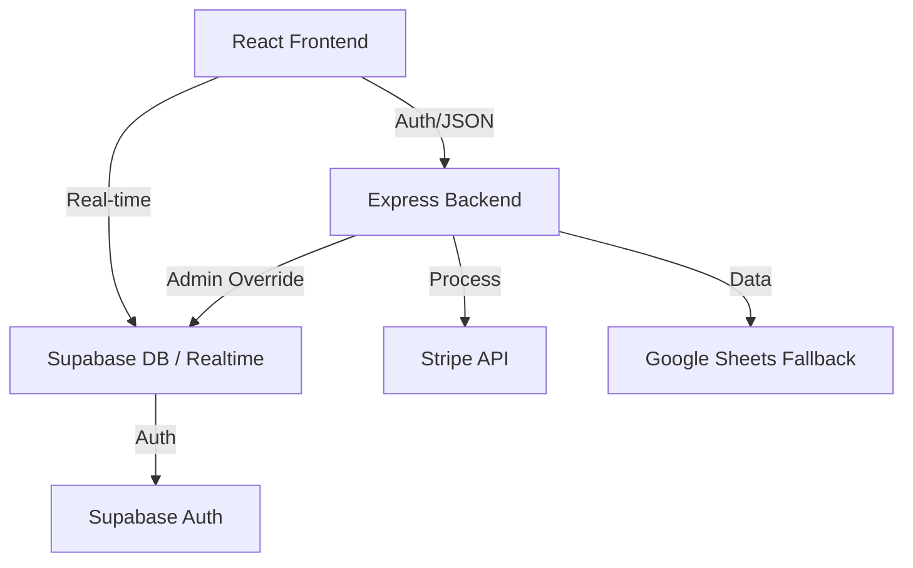

# TechCare - Complete System Architecture & Flow Diagrams

This document illustrates the logical flow, data architecture, and interaction models of the TechCare application.

## 1. High-Level Architecture

---

## 2. Core Logic Flows

### A. The Booking Lifecycle (Customer -> Technician)
1.  **Request**: Customer fills `QuickBookingForm` or `Schedule.jsx`.
2.  **Payment**: System creates a `pending_payment` booking and redirects to Stripe.
3.  **Confirmation**: On success, status changes to `pending` (for auto-assign) or `confirmed` (if tech selected).
4.  **Marketplace**: If no tech selected, booking appears in Technician "Available Jobs".
5.  **Bidding**: Techs submit `bids`. Customer accepts bid -> Status changes to `scheduled`.
6.  **Fulfillment**: Tech updates status: `pickup` -> `diagnosis` -> `repairing` -> `testing` -> `completed`.
7.  **Closure**: Status `completed` triggers invoice generation and allows Review entry.

### B. Real-time Synchronization Flow
1.  Frontend component mounts and calls `realtimeService.subscribeToX()`.
2.  `RealtimeService` creates (or joins) a Supabase Broadcast Channel.
3.  Database mutation occurs (via Backend API or SQL Trigger).
4.  Supabase emits a `postgres_changes` event.
5.  `RealtimeService` catches event and executes all registered component callbacks.
6.  Component calls `fetchData()` or updates state in-place.

---

## 3. Detailed Data Schemas (Supabase)

### `bookings` Table
| Column | Type | Purpose |
|--------|------|---------|
| `id` | UUID (PK) | Unique ID |
| `customer_id` | UUID (FK) | Link to `customers.id` |
| `technician_id`| UUID (FK)| Link to `technicians.id` (Nullable) |
| `status` | Text | `pending`, `confirmed`, `in_progress`, `completed`, `cancelled` |
| `device_type` | Text | `smartphone`, `laptop`, `pc` |
| `issue_description`| Text | User entered details |
| `estimated_cost`| Numeric | Total price in LKR |
| `scheduled_date` | Timestamp | Appointment time |

### `notifications` Table
| Column | Type | Purpose |
|--------|------|---------|
| `user_id` | UUID (FK) | Recipient ID |
| `type` | Text | `booking_update`, `new_bid`, `payment_success` |
| `title` | Text | Display title |
| `message` | Text | Body content |
| `read` | Boolean | Read status |

---

## 4. API Endpoint Map (100% Coverage)

### Admin Operations (`/api/admin`)
- `GET /stats`: Aggregate data for charts.
- `GET /users`: List all authenticated users.
- `PATCH /technicians/:id/verify`: Approve/Reject tech applications.
- `PUT /services/:id`: Update master price list.

### Technician Hub (`/api/technicians`)
- `GET /dashboard`: Complex fetch: Profile + Stats + Gigs + Active Jobs.
- `GET /jobs`: Marketplace fetch - excludes jobs where tech has active bid.
- `POST /bids`: Create interest in a job.
- `PUT /profile`: Update shop details & availability.
- `POST /withdraw`: Payout request.

### Customer Hub (`/api/customers`)
- `GET /me/bookings`: User specific history.
- `POST /favorites`: Link tech to user.
- `DELETE /me`: full GDPR account deletion.

---

## 5. Security & Permission Flow (RLS)
- **Public**: Can Read `technicians`, `services`, `reviews`.
- **Authenticated**: Can Read `profiles` (Self), `notifications` (Self).
- **Customer**: Can CRUD `user_devices` (Self), Create `bookings`, CRUD `favorites` (Self).
- **Technician**: Can Read `bookings` (Assigned), Create `bids`, CRUD `gigs` (Self).
- **Admin**: All access via `service_role` key in backend.
